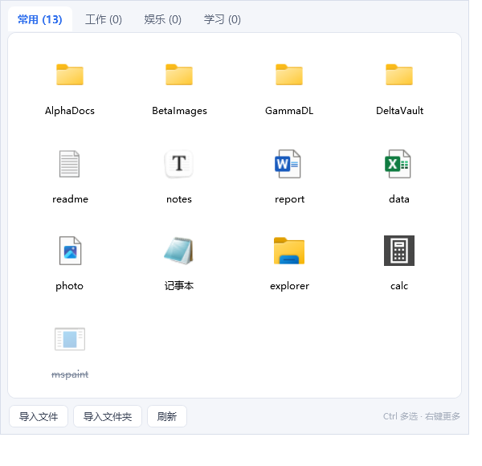

# 快捷方式管理器

一个便携式的小工具：把常用的文件/文件夹收进一个居中的小窗口，分组管理、双击即开。



## 特性

- **启动快** — 冷启动到窗口出现约 **500 ms**
- **小窗口居中** — 打开即出现在屏幕中央，可自由拖动/缩放
- **分组 = Tab** — 分组数量不限，点击 tab 切换；分组可重命名、左右移动、删除
- **每行固定四个** — 一行四格、紧凑排列，数量不限，超出自动滚动
- **自动取图标** — 文件夹显示文件夹图标，文件显示系统里该文件类型的图标
- **默认名字** — 文件夹名 / 不含扩展名的文件名，例如 `report.docx` → `report`
- **双击打开** — 双击格子打开文件或文件夹（用系统默认程序）
- **右键菜单** — 打开 / 在资源管理器中显示 / 重命名 / 编辑路径 / 发送到其他分组 / 移除 / 打开所在目录 / 复制路径
- **拖拽排序** — 按住格子拖到目标位置，左侧或右侧出现蓝色插入线，松手即完成排序
- **拖入即导入** — 从资源管理器把文件/文件夹直接拖进窗口就能添加
- **便携** — 配置存在 exe 同目录的 `config.json`，整个文件夹拷走即可迁移；
  位于程序目录内的条目自动存为**相对路径**，迁移后依然有效

## 快速开始

直接运行 `dist\ShortcutManager\ShortcutManager.exe`。

第一次打开是空的，用下面任一方式添加内容：

1. 从资源管理器把文件/文件夹**拖进窗口**
2. 点底部**「导入文件」**或**「导入文件夹」**（可多选）

然后就可以双击打开了。

## 操作一览

| 操作 | 方式 |
| --- | --- |
| 打开 | 双击格子 / 选中后按 `Enter` |
| 重命名 | 右键 → 重命名 / 选中后按 `F2`（`Enter` 确认，`Esc` 取消） |
| 移除 | 右键 → 移除 / 选中后按 `Delete` |
| 发送到其他分组 | 右键 → 发送到其他分组 → 选目标分组 |
| 排序 | 按住格子拖到目标位置 |
| 切换分组 | 点击 tab |
| 新建分组 | 右键 tab → 新建分组 / `Ctrl+T` |
| 删除分组 | 右键 tab → 删除分组 |
| 重命名分组 | 双击 tab / 右键 tab → 重命名分组 |
| 移动分组 | 右键 tab → 左移 / 右移 |
| 最小化窗口 | `Esc` / `Ctrl+W` |
| 还原窗口 | 点任务栏图标 / 再运行一次 exe |
| 退出程序 | 点窗口关闭按钮 / `Ctrl+Q` |

> 移除只把条目从列表里删掉，**不会删除磁盘上的文件**。

### 窗口行为

窗口是**普通窗口**：不置顶，失去焦点时不做任何特殊处理。
点到别的程序，本窗口就和其他软件一样被盖到后面，不会被自动最小化或隐藏。

需要收起时按 `Esc` 或 `Ctrl+W` 最小化到任务栏。

### 退出与还原

**没有托盘图标，关闭就是退出**。程序也不会常驻后台。

- 关闭：点窗口右上角 `✕`，或按 `Ctrl+Q`
- 最小化后还原：点任务栏图标；窗口被最小化时**再双击一次 exe** 也会把它还原到前台（不会开第二个进程）

## 数据与便携性

配置文件位置按以下顺序决定：

1. **exe 同目录的 `config.json`**（首选，保证便携）
2. 如果 exe 所在目录不可写（例如放在只读介质、`Program Files`），
   自动回退到 `%APPDATA%\ShortcutManager\config.json`

配置采用**原子写入**（先写临时文件再替换），写入过程中断电不会损坏已有配置。
如果配置文件被外部破坏，程序会把它备份为 `config.json.bak` 并回到默认分组，不会静默丢数据。

添加（或右键编辑路径）时，如果目标与 exe 同目录或位于其子目录，
`config.json` 里会存成相对路径（如 `tools\report.docx`），使用时再按程序目录解析回完整路径；
目录之外的条目仍存绝对路径。这样连同数据一起把整个文件夹拷到别的机器/盘符，条目不会失效。

## 运行环境

需要 **.NET 9 桌面运行时**（Windows Desktop Runtime）。

- 已装：直接跑，`dist` 只有 4 个文件、约 **0.25 MB**
- 没装：去 <https://dotnet.microsoft.com/download/dotnet/9.0> 下载
  **Desktop Runtime**（x64）安装即可

> 之所以不打包成自包含单文件：那样体积会到 60–80 MB。
> 如果你更看重「拷到任何机器都能跑」，把 `src/ShortcutManager.csproj`
> 里的发布参数加上 `-r win-x64 --self-contained true /p:PublishSingleFile=true` 重新发布即可
> （见 `tools/publish.ps1`）。

## 从源码构建

```powershell
# 开发构建
dotnet build src\ShortcutManager.csproj -c Release

# 生成便携包到 dist\ShortcutManager\
powershell -ExecutionPolicy Bypass -File tools\publish.ps1
```

## 项目结构

```
src/
  App.xaml(.cs)              程序入口、单实例、退出
  MainWindow.xaml(.cs)       界面与全部交互（tab / 网格 / 右键 / 拖拽 / 重命名 / 编辑路径）
  PathEditDialog.xaml(.cs)   编辑路径对话框
  Converters.cs              bool -> Visibility
  WindowEffects.cs           Win11 圆角（失败无副作用）
  Models/
    ShortcutItem.cs          一个条目：路径 + 覆盖名 + 默认命名规则
    ShortcutGroup.cs         一个分组：名字 + 条目列表
  Services/
    ConfigStore.cs           便携式配置读写（原子写入 + 损坏容灾）
    PathResolver.cs          便携相对路径：存储转换 + 解析
    ShellIcons.cs            Win32 Shell API 取系统图标 + 兜底图标
    Launcher.cs              双击打开 / 资源管理器定位
    ImportService.cs         路径导入 + 图标预热
  ViewModels/
    MainViewModel.cs         分组集合、选中态、增删改排序、保存
    ShortcutGroupViewModel.cs
    ShortcutViewModel.cs
  SelfTest.cs                --selftest：图标 / 配置 / 命名规则自检
  LogicTests.cs              --test：70+ 项逻辑回归测试
tools/
  publish.ps1                生成 dist\ShortcutManager\ 便携包
  verify.ps1                 逻辑测试 + 自检 + 启动耗时 + 截图
  make-icon.ps1              重新生成 app.ico
```

## 自检与测试

程序内置了不依赖界面的自检，方便回归：

```powershell
$exe = "dist\ShortcutManager\ShortcutManager.exe"

# 图标提取、配置读写、命名规则
& $exe --selftest      # 结果写入 exe 同目录 selftest.log，退出码 0 = 全通过

# 70+ 项逻辑测试：分组/条目增删改、排序、跨组移动、去重、
# 相对路径转换与导入、配置往返与损坏容灾
& $exe --test          # 结果写入 logic-test.log，退出码 0 = 全通过
```

完整验证（含截图与启动耗时）：

```powershell
powershell -ExecutionPolicy Bypass -File tools\verify.ps1     # 逻辑测试 + 自检 + 启动耗时 + 截图
powershell -ExecutionPolicy Bypass -File tools\publish.ps1    # 生成 dist\ShortcutManager\
```

### 开发用调试参数

| 参数 | 作用 |
| --- | --- |
| `--selftest` | 图标/配置/命名自检，写 `selftest.log` 后退出 |
| `--test` | 逻辑回归测试，写 `logic-test.log` 后退出 |
| `--diag` | 启动后把窗口尺寸/DPI 变换写入 `diag.log` |
| `--shot <路径>` | 启动后渲染自身并保存 PNG，然后退出（用 `RenderTargetBitmap`，不受 DPI 影响） |
| `--import <路径>` | 启动后直接把该路径导入当前分组 |

## 实现备注

- **每行四个**用 `UniformGrid Columns="4"` 实现，格子宽度随窗口自适应，
  不会出现第四列被裁掉的问题。
- **图标取用**走 `SHGetFileInfo`（`SHGFI_ICON | SHGFI_LARGEICON`），
  对不存在的路径回退到 `SHGFI_USEFILEATTRIBUTES`，因此删掉的文件也还能显示类型图标；
  Shell 也失败时用程序内绘制的兜底图标。图标结果永久缓存，并在后台线程预热。
- **窗口没有开亚克力/模糊**。实测第三方背景模糊会让整窗内容发灰发虚，
  对这类小工具得不偿失；只在 Win11 上加了系统圆角。
- **窗口行为刻意保持普通**：不置顶、不监听 `Deactivated`。
  早期版本试过「失焦自动隐藏/最小化」，需要一套抑制计数来排除右键菜单、
  对话框、输入法、拖拽等场景，既复杂又容易出现「窗口莫名消失」的观感，现已全部移除。
- **拖拽排序**用 WPF 原生 `DragDrop`，按住即拖（与桌面软件惯例一致）：
  靠近目标格子左半边显示左插入线，右半边显示右插入线。
- **重命名冲突**：如果新名字等于默认名，会把覆盖名清空而不是存一份冗余副本，
  这样以后文件改名了显示名也会跟着变。
